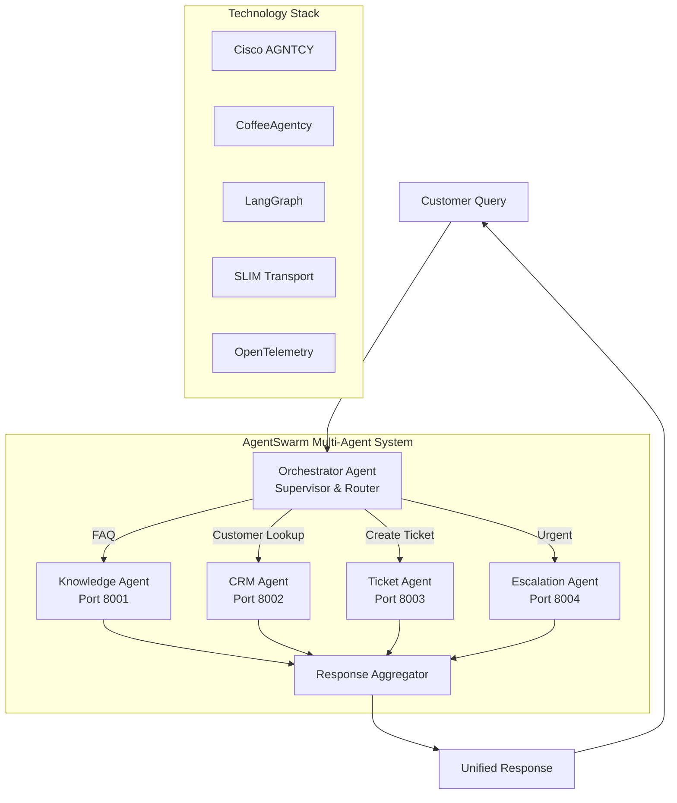

# AgentSwarm Architecture Diagram

## ASCII Diagram (for presentations)

```
+==============================================================================+
|                        AgentSwarm for Contact Center                          |
|                   Built on Cisco AGNTCY + CoffeeAgentcy                      |
+==============================================================================+

                              CUSTOMER QUERY
                                    |
                                    v
+------------------------------------------------------------------------------+
|                                                                              |
|    +------------------------------------------------------------------+     |
|    |                    ORCHESTRATOR AGENT                             |     |
|    |                      (Supervisor)                                 |     |
|    |                                                                   |     |
|    |   [Intent Classification] --> [Route to Specialists]             |     |
|    |                                                                   |     |
|    |   Intents: FAQ | Customer Lookup | Ticket | Escalation | General |     |
|    +------------------------------------------------------------------+     |
|                    |           |           |           |                     |
|         +----------+    +------+    +------+    +------+                     |
|         |               |           |           |                            |
|         v               v           v           v                            |
|    +---------+    +---------+  +---------+  +-----------+                   |
|    |KNOWLEDGE|    |   CRM   |  | TICKET  |  |ESCALATION |                   |
|    |  AGENT  |    |  AGENT  |  |  AGENT  |  |   AGENT   |                   |
|    +---------+    +---------+  +---------+  +-----------+                   |
|    | Port:   |    | Port:   |  | Port:   |  | Port:     |                   |
|    | 8001    |    | 8002    |  | 8003    |  | 8004      |                   |
|    +---------+    +---------+  +---------+  +-----------+                   |
|    |         |    |         |  |         |  |           |                   |
|    | FAQ     |    | Customer|  | Create/ |  | Route to  |                   |
|    | Answers |    | Data    |  | Track   |  | Human     |                   |
|    |         |    | History |  | Tickets |  | Support   |                   |
|    +---------+    +---------+  +---------+  +-----------+                   |
|         |               |           |           |                            |
|         +-------+-------+-----------+-----------+                            |
|                 |                                                            |
|                 v                                                            |
|    +------------------------------------------------------------------+     |
|    |                    RESPONSE AGGREGATOR                           |     |
|    |              Combines specialist responses                        |     |
|    +------------------------------------------------------------------+     |
|                                    |                                         |
+------------------------------------------------------------------------------+
                                    |
                                    v
                           UNIFIED RESPONSE
                            TO CUSTOMER


+==============================================================================+
|                           TECHNOLOGY STACK                                    |
+==============================================================================+

  +-------------+     +-------------+     +-------------+     +-------------+
  |   AGNTCY    |     | CoffeeAgntcy|     |  LangGraph  |     |   FastAPI   |
  |  Framework  |     |  Patterns   |     | Orchestration|    |   Servers   |
  +-------------+     +-------------+     +-------------+     +-------------+

  +-------------+     +-------------+     +-------------+     +-------------+
  |    SLIM     |     |     A2A     |     |OpenTelemetry|     |   Grafana   |
  |  Transport  |     |  Protocol   |     |   Tracing   |     | Dashboards  |
  +-------------+     +-------------+     +-------------+     +-------------+

  +-------------+     +-------------+
  |   OpenAI    |     |   Webex     |
  |  GPT-4o-mini|     |Contact Ctr  |
  +-------------+     +-------------+


+==============================================================================+
|                           DATA FLOW                                          |
+==============================================================================+

  1. Customer sends query via API/Webex
  2. Orchestrator classifies intent
  3. Orchestrator routes to specialist agent(s)
  4. Specialist agents process in parallel
  5. Responses aggregated by Orchestrator
  6. Unified response returned to customer
  7. All steps traced via OpenTelemetry


+==============================================================================+
|                           DEMO SCENARIOS                                     |
+==============================================================================+

  SCENARIO 1: FAQ                    SCENARIO 2: Customer Context
  "How to reset password?"           "Internet slow, order #12345"
           |                                    |
           v                                    v
      Orchestrator                         Orchestrator
           |                                /       \
           v                               v         v
     Knowledge Agent               Knowledge    CRM Agent
           |                         Agent           |
           v                            \           /
      Answer with                        v         v
      step-by-step                     Aggregated Response
      instructions                     with customer context


  SCENARIO 3: Escalation             SCENARIO 4: Ticket Creation
  "URGENT: System down!"             "Create ticket for issue"
           |                                    |
           v                                    v
      Orchestrator                         Orchestrator
           |                                    |
           v                                    v
    Escalation Agent                     Ticket Agent
           |                                    |
           v                                    v
    Route to human +                    Ticket created +
    Create P1 ticket                    Tracking number
```

---

## Mermaid Diagram (for docs/slides)



---

## Simple Slide Layout

### Slide 1: Title
```
+------------------------------------------+
|                                          |
|         AgentSwarm                        |
|         =========                         |
|                                          |
|    Multi-Agent AI for                    |
|    Webex Contact Center                  |
|                                          |
|    Built on Cisco AGNTCY                 |
|    & CoffeeAgentcy                       |
|                                          |
|    [Your Name]                           |
|    Webex Playtime FY26                   |
|                                          |
+------------------------------------------+
```

### Slide 2: Problem
```
+------------------------------------------+
|                                          |
|    The Problem                           |
|    ===========                           |
|                                          |
|    - Single AI agents are limited        |
|    - Can't handle complex queries        |
|    - No specialization                   |
|    - No collaboration                    |
|    - High human workload                 |
|                                          |
+------------------------------------------+
```

### Slide 3: Solution
```
+------------------------------------------+
|                                          |
|    The Solution: AgentSwarm              |
|    ========================              |
|                                          |
|    Multiple specialized AI agents        |
|    that collaborate in real-time         |
|                                          |
|    - Orchestrator (supervisor)           |
|    - Knowledge Agent (FAQ)               |
|    - CRM Agent (customer data)           |
|    - Ticket Agent (support tickets)      |
|    - Escalation Agent (urgent routing)   |
|                                          |
+------------------------------------------+
```

### Slide 4: Architecture
```
+------------------------------------------+
|                                          |
|    [Insert ASCII diagram from above]     |
|                                          |
+------------------------------------------+
```

### Slide 5: Demo
```
+------------------------------------------+
|                                          |
|    Live Demo                             |
|    =========                             |
|                                          |
|    Scenario 1: FAQ Query                 |
|    Scenario 2: Customer Context          |
|    Scenario 3: Urgent Escalation         |
|                                          |
+------------------------------------------+
```

### Slide 6: Results
```
+------------------------------------------+
|                                          |
|    Benefits                              |
|    ========                              |
|                                          |
|    - 60% faster issue resolution         |
|    - Reduced human workload              |
|    - Personalized responses              |
|    - Full observability                  |
|    - Scalable architecture               |
|                                          |
+------------------------------------------+
```

### Slide 7: Tech Stack
```
+------------------------------------------+
|                                          |
|    Built With Cisco Technology           |
|    ==========================            |
|                                          |
|    - Cisco AGNTCY Framework              |
|    - CoffeeAgentcy Patterns              |
|    - A2A Protocol + SLIM                 |
|    - LangGraph Orchestration             |
|    - OpenTelemetry Observability         |
|    - Ready for Webex Integration         |
|                                          |
+------------------------------------------+
```

### Slide 8: Thank You
```
+------------------------------------------+
|                                          |
|    Thank You!                            |
|    ==========                            |
|                                          |
|    Questions?                            |
|                                          |
|    GitHub: github4-chn.cisco.com/        |
|            rguvvala/coffeeAgentify       |
|                                          |
+------------------------------------------+
```

